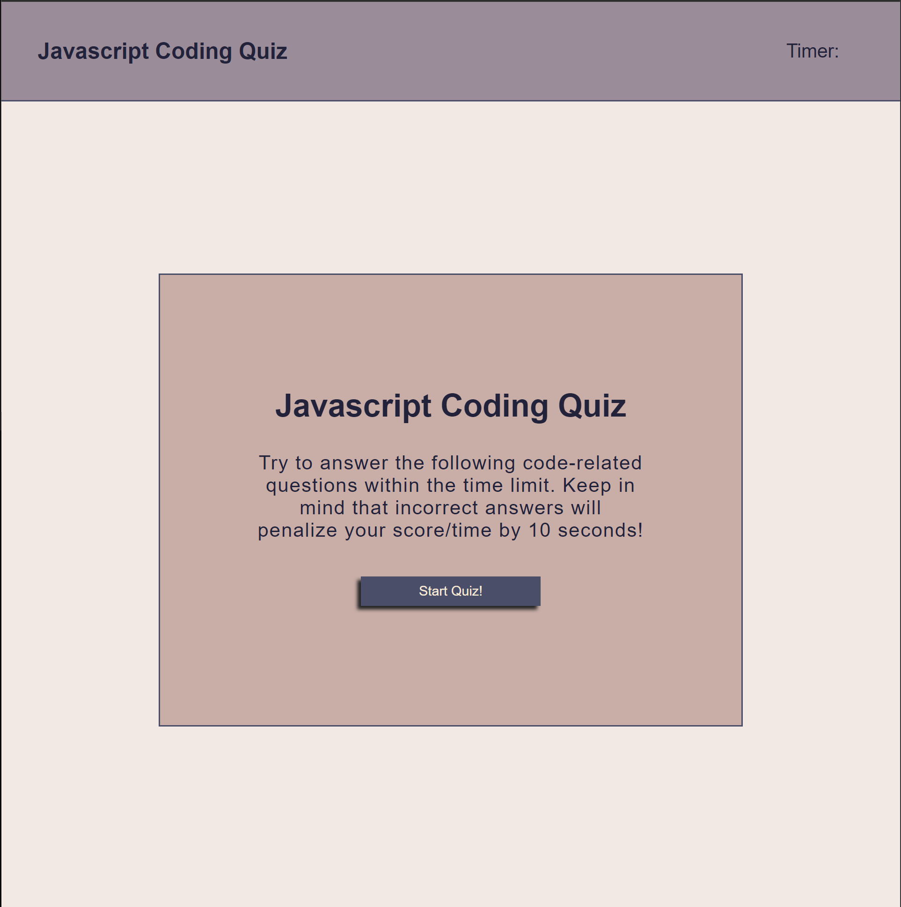

# js_code_quiz

My completed code quiz challenge.  Upon pressing the 'start' button you are displayed a series of question and a timer starts counting down from 60 seconds. You are given 4 multiple choice answers to choose from.  If the wrong answer is selected, 'wrong answer' will be displayed on the next screen.  If the correct answer is selected, 'correct' will be displayed.  Each correct answer is worth 5 points.  Every wrong answer will see 10 seconds deducted from the timer.  

The quiz is over when either all the questions have been answered or the timer runs out.  You are then prompted to enter your initials.  It then checks to see if you have beaten the current high score.  If so, you're initials and score will be displayed on the final page.  If not, the previous high score and inititals will be displayed.  There are two buttons.  One to start the quiz over, the other to clear the high score and start the quiz over.

## Made With:

* HTML

* CSS

* JavaScript

## Website Url:

* https://bdunham484.github.io/js_code_quiz/

* Made with ❤️ by Brad Dunham

